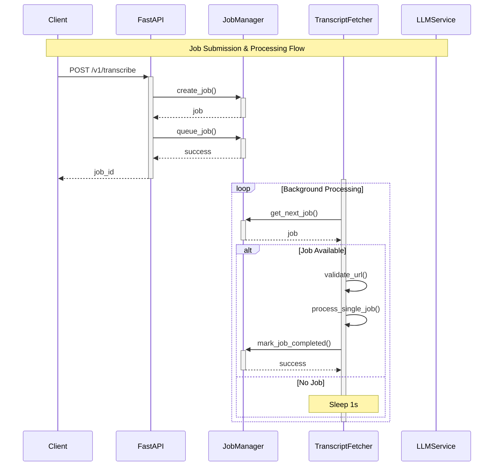
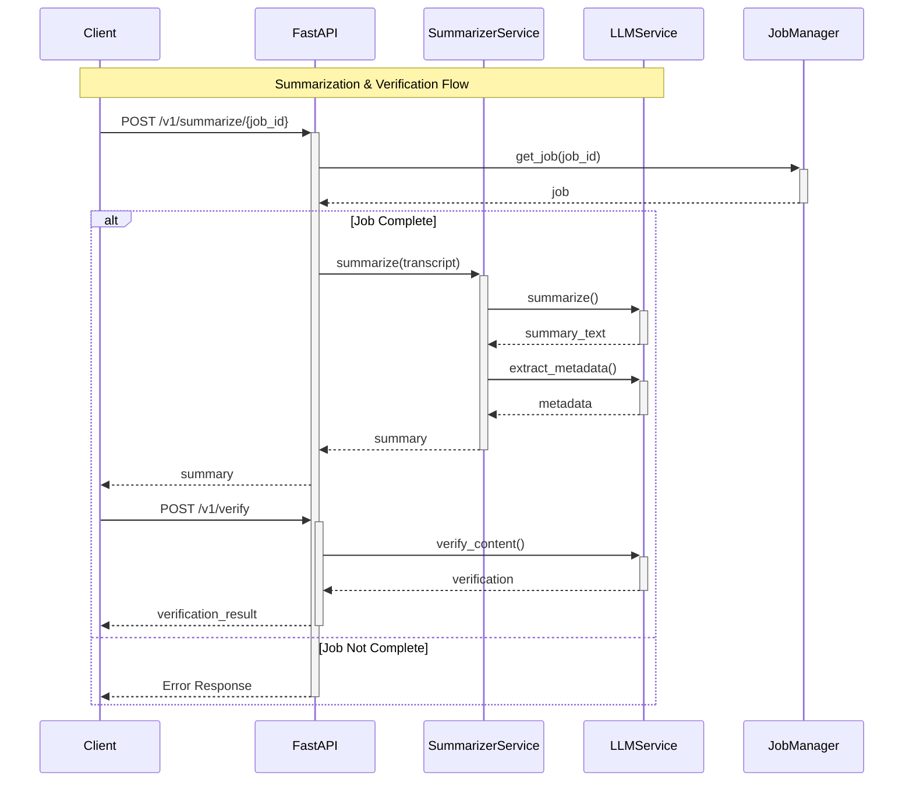

# Transcript Processor Service

A standalone FastAPI service for processing audio transcripts with features including job management, summarization, and content verification. The service provides a robust API for handling audio transcription jobs with priority queuing, async processing, and comprehensive error handling.

## Features

### Core Functionality
- **Async Job Processing**: Handle multiple transcription jobs asynchronously with priority queuing (HIGH, MEDIUM, LOW)
- **Job Management**: Track and manage transcription jobs through their lifecycle (PENDING → PROCESSING → COMPLETED/FAILED)
- **Transcript Summarization**: Generate summaries of transcribed content using LLM
- **Content Verification**: Safety checks for inappropriate content, profanity, and PII
- **Priority Queue System**: Process jobs based on priority levels and submission time

### Technical Features
- **Robust Error Handling**: Comprehensive exception handling with detailed error messages
- **Request Logging**: Detailed request logging with processing time tracking
- **Sentry Integration**: Error tracking and monitoring support
- **CORS Support**: Configurable CORS middleware
- **Health Checks**: Basic health check endpoints
- **Docker Support**: Containerized deployment ready

## Prerequisites

- Python 3.11+
- OpenAI API key
- Sentry DSN (optional but recommended for production)

## Configuration

Create a `.env` file in the root directory with the following variables:

```env
OPENAI_KEY=your_openai_api_key
OPEN_AI_MODEL=gpt-4o-mini  # or another compatible model
SENTRY_DSN=your_sentry_dsn
ENVIRONMENT=dev  # or prod
```

**Note**: The service includes a JSON response parser specifically tuned for `gpt-4o-mini`. While other models may work, they haven't been extensively tested.

## Installation

### Using Docker (Recommended)

```bash
# Build the image
docker build -t transcript-processor .

# Run the container
docker run -p 80:80 --env-file .env transcript-processor
```

### Manual Installation

```bash
# Create and activate virtual environment
python -m venv venv
source venv/bin/activate  # or `venv\Scripts\activate` on Windows

# Install dependencies
pip install -r requirements.txt

# Run the service
uvicorn app.app:app --host 0.0.0.0 --port 80
```

## API Endpoints

### Core Endpoints
- `POST /v1/transcribe`: Submit URLs for transcription
- `GET /v1/jobs`: Get status of all jobs
- `GET /v1/jobs/{job_id}`: Get status of a specific job
- `POST /v1/summarize/{job_id}`: Generate summary for a completed transcription
- `POST /v1/verify`: Verify summary content for inappropriate material

### Debug Endpoints
- `POST /v1/debug/force-cleanup`: Force cleanup of expired jobs
- `POST /v1/debug/create-test-job`: Create a test job
- `GET /docs`: Built in Swagger docs with sample API usage


### Health Checks
- `GET /`: Basic alive check
- `GET /health`: Health check endpoint

## Current Limitations and TODOs

### Known Limitations
1. **Single Worker Deployment**: The service currently uses a single Gunicorn worker due to job management state sharing limitations. Multiple workers would create separate JobManager instances, leading to inconsistent state.

2. **Simulated Transcription**: Currently using fixture data for transcript generation. Integration with actual transcription service pending.

3. **In-Memory Storage**: Job management is currently handled in-memory. For production use, consider implementing persistent storage.

### TODO List
1. **Tests**: Implement comprehensive test suite including:
   - Unit tests for all services
   - Integration tests for API endpoints
   - Load testing for job management system

2. **Features**:
   - Implement actual transcription service integration
   - Add persistent storage for job management
   - Implement the unused `export_jobs_report` functionality
   - Add proper cleanup for system-level failures (`mark_job_failed_system_error`)
   - Implement batch summarization functionality

3. **Improvements**:
   - Enhance job manager to support multiple workers
   - Add proper URL revalidation before processing
   - Implement more sophisticated error recovery
   - Add proper metrics and monitoring
   - Add proper API documentation

## Architecture Notes

### System Flows

#### Job Submission and Processing
The following diagram illustrates the flow of job submission and processing:



#### Summarization and Verification Flow
The following diagram shows how summarization and content verification work:



### Job Management
The service implements a priority-based job queue system using Python's `asyncio.PriorityQueue`. Jobs move through states:
1. PENDING: Initial state
2. PROCESSING: Being processed
3. COMPLETED/FAILED: Final states

### Error Handling
Comprehensive error handling including:
- Validation errors
- Transcription errors
- LLM-related errors (timeout, rate limits)
- Job management errors
- General system errors

### Monitoring
- Sentry integration for error tracking
- Detailed logging with file and line numbers
- Request timing middleware

## Development Notes

### Local Development
```bash
# Run with auto-reload
uvicorn app.app:app --reload --host 0.0.0.0 --port 80
```

### Environment Variables
The service uses `pydantic-settings` for configuration management. See `config.py` for available settings.

## License
 Apache License